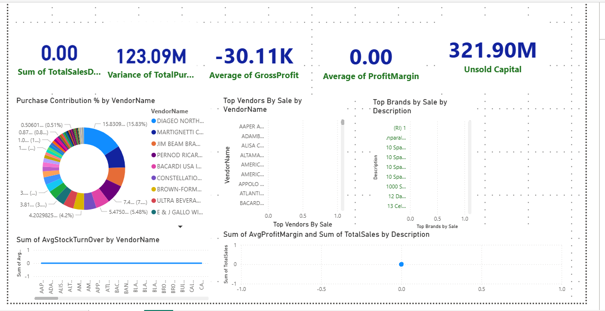

# Vendor Performance Data Analytics

## 📌 Project Overview
The **Vendor Performance Data Analytics** project analyzes vendor-related data to evaluate performance, identify inefficiencies, and enable data-driven business decisions.

This project demonstrates a complete **end-to-end data analytics workflow**, starting from Excel data ingestion, processing using Python, storage in MySQL, analysis using SQL, and visualization using Power BI.

---

## 🛠️ Technologies Used
- **Programming Language:** Python  
- **Database:** MySQL  
- **Database Tool:** MySQL Workbench  
- **Libraries:** Pandas, NumPy  
- **Visualization Tool:** Power BI  
- **Data Source:** Excel Files  

---

## 📂 Project Workflow
Excel Files
↓
Python (Pandas, NumPy)
↓
MySQL Database
↓
SQL Queries
↓
Power BI Dashboard

---

## 📊 Key Features
- Load vendor data from **Excel files** using Pandas
- Perform data cleaning and transformation using Python
- Insert processed data into **MySQL database**
- Execute analytical queries using **SQL**
- Build interactive **Power BI dashboards**
- Analyze vendor performance using KPIs and trends

---

## 📁 Data Processing Steps
1. Import vendor data from Excel files using Pandas  
2. Clean and preprocess data (handling null values, formatting, validation)  
3. Insert cleaned data into MySQL tables  
4. Perform vendor performance analysis using SQL  
5. Visualize insights using Power BI  

---


## 📈 Power BI Dashboard

### 🔹 Vendor Performance Dashboard


### Dashboard Highlights:
- Total Sales & Purchase Variance
- Gross Profit & Profit Margin analysis
- Unsold Capital tracking
- Vendor-wise purchase contribution
- Top vendors by sales
- Brand-level sales analysis
- Stock turnover insights

> 📌 *The dashboard is interactive and allows filtering by vendor and brand to analyze performance efficiently.*

---

## 🚀 How to Run the Project
1. Clone the repository:
   ```bash
   git clone https://github.com/pawan-88/Vendor_Performance_Data_Analytics.git
